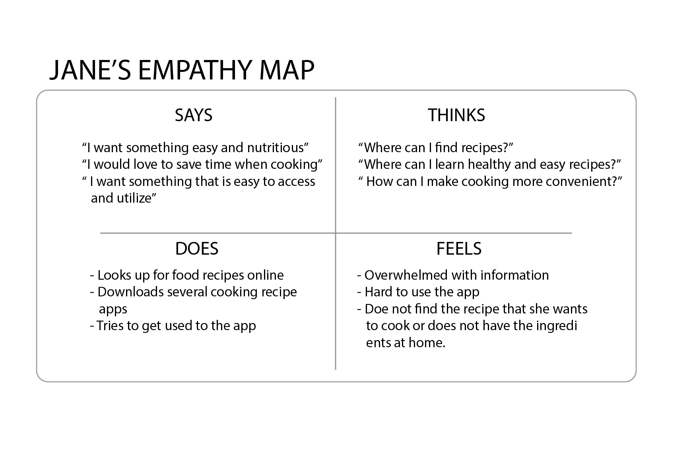
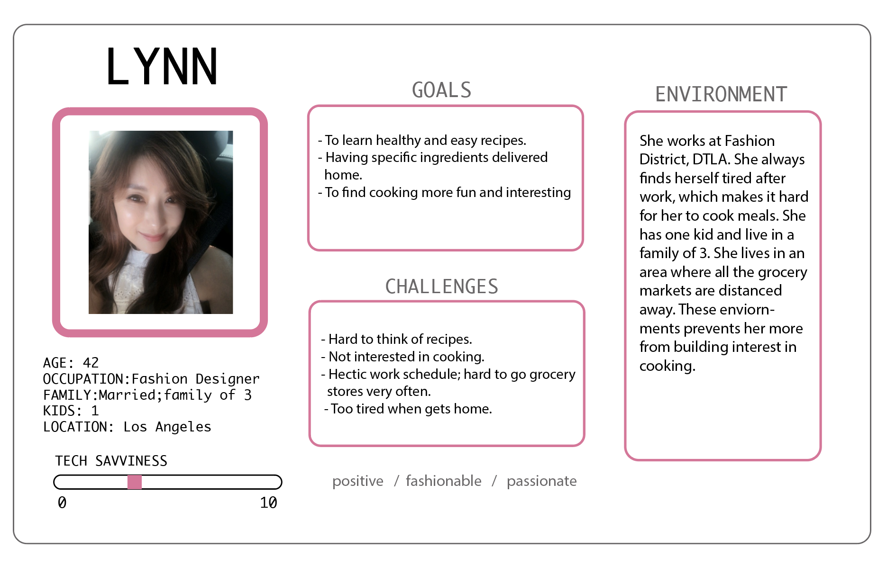
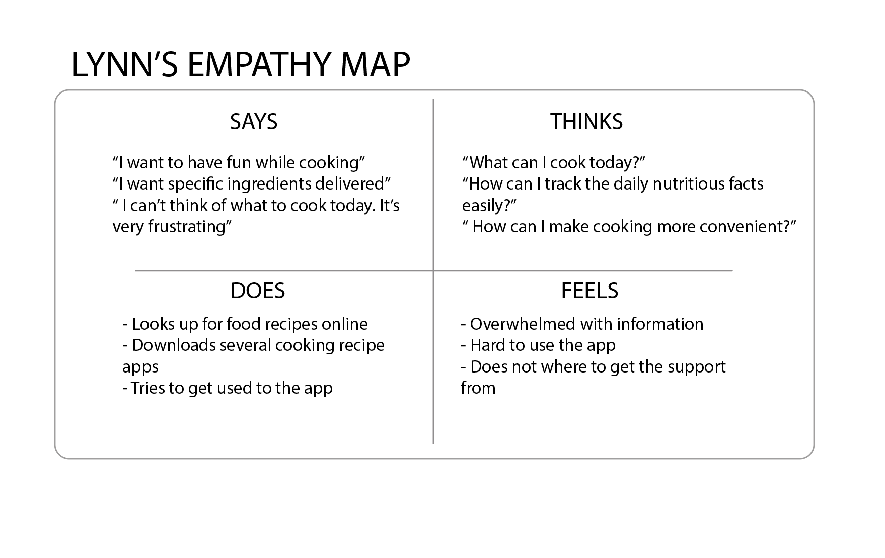
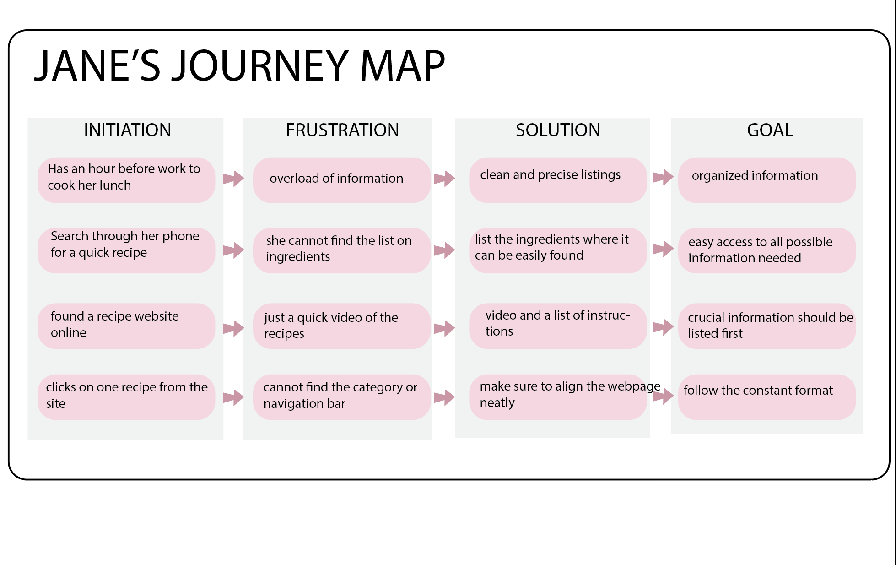
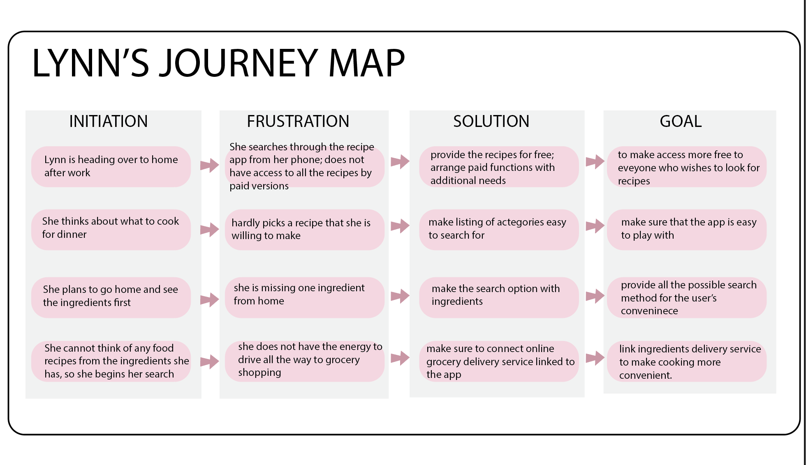

DH150- Assignment 5: Persona + Scenario
### Created by GeeYun Chae

# Purpose of UX Storytelling
#### The UX storytelling is a powerful tool that allows to shift one's perspective into the user's perspective. By storytelling, it allows the viewers to follow the persona's perspective. List of prototypes of persona, followed by the empathy map, both allows the user and the designer to have a better view of enhancing the design process. It goes into careful examination of the design to fulfill the gain, pains, and specific needs. 

# Features proposed for UX design
#### 1. Easier access throughout the web with consistency
#### 2. Efficient design to let the users do grocery shopping through the app.

# Persona Creation and Empathy Maps
### Proto Persona 1: 

### Jane's Empathy Map

### Proto Persona 2:

### Lynn's Empathy Map

# User Scenarios and Journey Maps
### 1. Jane's Scenario
#### Jane feels like she spends too much money on her lunch. She now has an hour to pack her lunch before going to work. She does not have enough time to pack a decent lunch, so she brings her phone out and searches for a quick, easy, and healthy recipe. She finds a food recipe website online and clicks on the recipe from the site.
#### However, not familiar with the webiste's format arrangements, she just thinks it's overload of information. She hesitates to pick a recipe from whole list of information that is just thrown at her. After a brief search, she picks a recipe, but she is not able to pull up the information about the list of ingredients needed to cook the food. All she sees from the section is just a quick video of the recipe and struggles to find any other information. She is not able to look for the navigation or the category bar so she can see the main menu. 
#### She has spent more than half of her preparation time and is very frustrated. She closes the app and takes the frozen food from the freezer for her lunch. 
### Jane's Journey Map

### 2. Lynn's Scenario
#### After work, Lynn is very tired due to her hectic schedule and workload. She shortly think about what she should cook for dinner, but decides to head home first to see what ingredients she has first. As see arrives, she cannot think of any food with the ingredients that she has in her refrigerator. She starts her searrch from the recipe app. Since she's very tired, she does not want to spend too much time cooking and want to look for a recipe that is easy and healthy. 
#### She searches through the recipe app; However, it does not provide her much of an option because most of the recipes are only supported from the "paid version". From struggling, she hardly picks a recipe that she is willing to make. She runs to the refrigerator to check if she has all the ingredients. She is missing one ingredient from the list. She does not have the energy to drive all the way to the grocery store. It causes her frustration and she decides to give up. She takes out her phone again and order the delivery food. 

