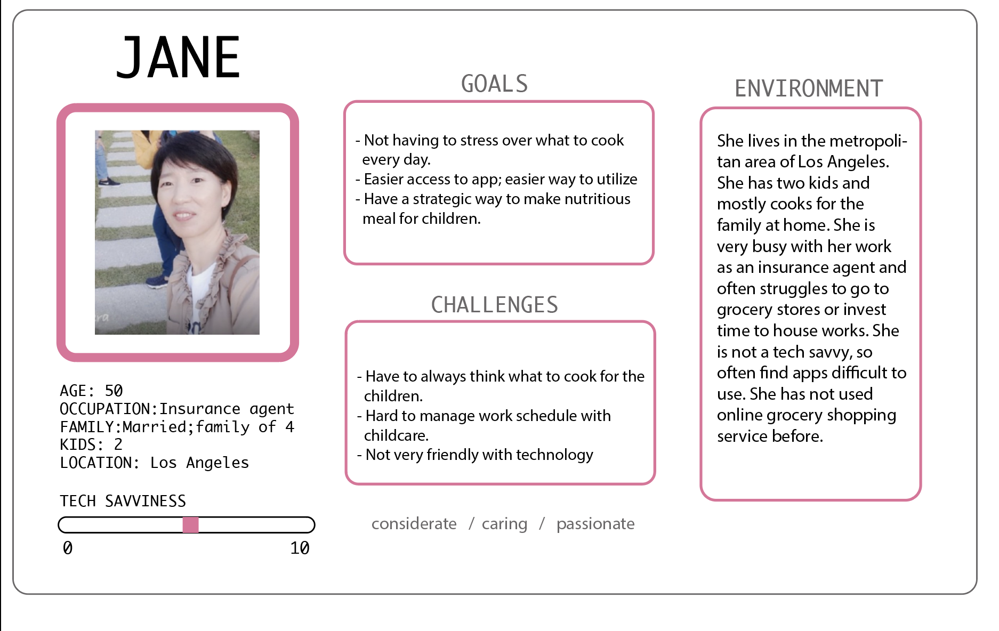

DH150- Assignment 5: Persona + Scenario
### Created by GeeYun Chae

# Purpose of UX Storytelling
The UX storytelling is a powerful tool that allows to shift one's perspective into the user's perspective. By storytelling, it allows the viewers to follow the persona's perspective. List of prototypes of persona, followed by the empathy map, both allows the user and the designer to have a better view of enhancing the design process. It goes into careful examination of the design to fulfill the gain, pains, and specific needs. 

# Features proposed for UX design
1. Easier access throughout the web with consistency (in design/ layout)
2. Efficient design to let the users do grocery shopping through the app.

# Persona Creation and Empathy Maps
### Proto Persona 1: 

### Jane's Empathy Map

### Proto Persona 2:

### Lynn's Empathy Map

# User Scenarios and Journey Maps
### 1. Jane's Scenario
Jnae is 50 years old and hse is mother of 2 kids. She lives in the metropolitan area of Los Angeles and works as an insurance agent. During this unpleasant time, she lacks time of working and also having to care of their children at home due to schools closing down. She mostly take cares of her lunch from take out food and struggles to take balanced meals.

Jane feels like she spends too much money on her lunch. She decieds to pack her lunch before going to work. She does not have enough time to pack a decent lunch, so she brings her phone out and searches for a quick, easy, and healthy recipe. She opens "CookCart" and clicks on the "lunch" category. She sees lists of options, and is having hard time deciding her lunch menu. She cliks on the filter and applies the "short cooking time" and sees the quick recipes that she can make at this hour. She picks on the pasta salad for her lunch today and head to the refrigerator to see if she has all the ingredients. She has all the ingredients, but does not have lettuce. She adds the recipe in to her cart, and remove all the other ingredients that she has on the list. She moves on to delivery section and picks the closest grocery store from her home and proceeds to check out. She tracks her order and it states that it will arrive in 15 minuntes. During the wait, she prepares for other ingredients by watching the video and receives a notification of the ingredients being deliverd. She heads to the door and recieves the ingredients. She cuts the lettuce and finish her last step of preparing the dish. She made it on time and is ready to go to work without any food wastes from her cooking. She is very satisfied with her experience with CookCart and leaves the house to work.
### Jane's Journey Map

### 2. Lynn's Scenario
After work, Lynn is very tired due to her hectic schedule and workload. She shortly think about what she should cook for dinner, but decides to head home first to see what ingredients she has first. As see arrives, she cannot think of any food with the ingredients that she has in her refrigerator. She starts her searrch from the recipe app. Since she's very tired, she does not want to spend too much time cooking and want to look for a recipe that is easy and healthy. 
She searches through the recipe app; However, it does not provide her much of an option because most of the recipes are only supported from the "paid version". From struggling, she hardly picks a recipe that she is willing to make. She runs to the refrigerator to check if she has all the ingredients. She is missing one ingredient from the list. She does not have the energy to drive all the way to the grocery store. It causes her frustration and she decides to give up. She takes out her phone again and order the delivery food. 

